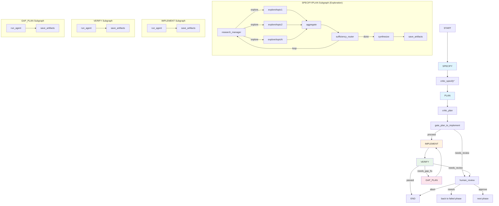
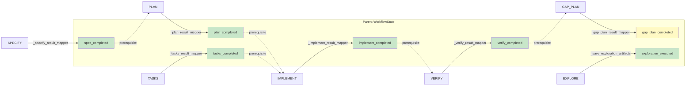

# SPINE Agent Graph — Structured Data Flow Architecture

**Supporting document for `combined_implementation_plan.md`**  
**Date:** 2026-05-23

This document visualizes how structured data flows through the SPINE agent graph, showing every handoff between agents, subgraphs, and the parent state.

---

## Agent Graph Topology (Full)



*\* critic_specify only in critical_task / critical_reviewed work types*

---

## Structured Data Flow Per Handoff

### H1: Exploration Manager → Explore Nodes

```
Manager output:  {"decision": "explore", "topics": ["auth", "database"]}
                       │
                       ▼
         _research_router(state) → [Send("explore", {"topic": "auth"}),
                                     Send("explore", {"topic": "database"})]
                       │
                       ▼
              _explore_node(state) builds researcher subagent
                       │
                       ▼
         ResearchFindings(summary="...", patterns=[...], file_map={...}, dependencies=[...])
                       │
                       ▼
              findings: Annotated[list[dict], operator.add]  ← accumulates
```

**Structured?** ✅ YES — `ResearchFindings` Pydantic model with `response_format`

### H2: Exploration Synthesis → SPECIFY Artifact

```
findings: list[ResearchFindings]
         │
         ▼
_synthesize_specify(state):
  - Formats findings as markdown
  - Builds specify agent with write_specification tool
  - Prompt: "Create specification incorporating codebase research findings"
         │
         ▼
specification.md (prose) + specification.json (structured) ← NEW
         │
         ▼
_save_exploration_artifacts(state):
  - Scans disk for specification.md and specification.json
  - Returns artifacts_output: {"specification.md": ..., "specification.json": ...}
  - Sets exploration_executed: True, synthesis_completed: True
```

**Structured?** 🔧 PARTIAL — today only `specification.md`. PLAN adds `specification.json`.

### H3: Exploration Synthesis → PLAN Artifact

```
findings: list[ResearchFindings] + specification.md on disk
         │
         ▼
_synthesize_plan(state):
  - Reads spec from disk
  - Builds plan agent with write_structured_plan tool
  - Prompt includes spec requirements + research findings
         │
         ▼
plan.md (prose) + plan.json (structured FeatureSlice array)
         │
         ▼
_compute_waves(plan_data):
  - Parses plan.json feature_slices
  - Runs topological sort via slice_scheduler
  - Returns execution_waves: [[FeatureSlice, ...], [FeatureSlice, ...]]
         │
         ▼
execution_waves propagated to parent WorkflowState via _plan_result_mapper
```

**Structured?** ✅ YES — `plan.json` with `feature_slices` is already structured. `execution_waves` is `list[list[dict]]`.

### H4: PLAN → IMPLEMENT (Gate)

```
_plan_result_mapper: execution_waves → parent WorkflowState
         │
         ▼
_implement_state_mapper: execution_waves → ImplementSubgraphState
         │
         ▼
gate_plan_to_implement: validates plan.json has valid feature_slices
  - plan.json must exist on disk
  - feature_slices array non-empty
  - Each slice has: id, title, target_files, execution_requirements, dependencies, acceptance_criteria
  - plan_completed invariant must be True ← NEW
```

**Structured?** ✅ YES — gate validates structured `plan.json` fields.

### H5: IMPLEMENT Orchestrator → Slice Implementers

```
execution_waves: [[{id:"slice-1", ...}, {id:"slice-2", ...}], [{id:"slice-3", ...}]]
         │
         ▼
run_agent (implement orchestrator):
  - Wave 0: task("slice-implementer", context={slice-1}) + task("slice-implementer", context={slice-2})
  - Parallel dispatch via eval + Promise.allSettled
  - Wave 1: task("slice-implementer", context={slice-3})
         │
         ▼
SliceResult(status="implemented", files_modified=[...], files_created=[...], test_results="...", issues=[])
```

**Structured?** 🔧 PARTIAL — `SliceResult` Pydantic model exists but DOES NOT get `response_format`. **Fix:** Enable `response_format=SliceResult`.

### H6: IMPLEMENT → VERIFY

```
_implement_result_mapper:
  - implement_completed: True ← NEW
  - artifacts_output: {"implementation.md": ...}
         │
         ▼
_verify_state_mapper:
  - plan_path, spec_path → VerifySubgraphState
  - Implementation files on disk (written by slice-implementers)
```

**Structured?** ✅ YES — implementation files on disk, `implementation.md` artifact.

### H7: VERIFY Orchestrator → Slice Verifiers

```
run_agent (verify orchestrator):
  - Reads implementation.md and slice files from disk
  - For each slice: task("slice-verifier", context={acceptance_criteria, files})
  - Parallel dispatch via eval + Promise.allSettled
         │
         ▼
VerificationResult(verdict="VERIFIED"|"NOT_VERIFIED", checklist=[CheckItem(...)], gaps=[...], recommendations=[...])
         │
         ▼
write_verification_report tool: writes verification.md with typed _VerificationResult objects
```

**Structured?** 🔧 PARTIAL — `VerificationResult` Pydantic model exists but DOES NOT get `response_format`. **Fix:** Enable `response_format=VerificationResult`.

### H8: VERIFY → GAP_PLAN (on failure)

```
_verify_result_mapper:
  - verify_completed: True ← NEW
  - phase_status: "needs_review" → needs_gap_fix (if attempts < 2)
         │
         ▼
_verify_router: "needs_gap_fix" → GAP_PLAN
         │
         ▼
_gap_plan_state_mapper:
  - verify_path, plan_path → GapPlanSubgraphState
  - verification.md on disk (contains structured VerificationResult data)
         │
         ▼
run_agent (gap_plan agent):
  - Reads verification.md for failure details
  - Reads plan.json for slice context
  - Produces gap_plan.md + gap_plan.json ← NEW
         │
         ▼
GapPlan(verification_summary="...", gaps_identified=N, fix_instructions=[FixInstruction(...)], re_verify_slices=[...])
```

**Structured?** ❌ NO — today uses generic filesystem tools, outputs unstructured markdown. **Fix:** Create `gap_plan_tools.py` with structured `GapPlan` model.

### H9: GAP_PLAN → IMPLEMENT (gap-fix loop)

```
_gap_plan_result_mapper:
  - gap_plan_completed: True ← NEW
  - artifacts_output: {"gap_plan.md": ..., "gap_plan.json": ...}
         │
         ▼
graph.add_edge(GAP_PLAN, IMPLEMENT)  ← existing edge
         │
         ▼
_implement_state_mapper:
  - gap_plan_path → ImplementSubgraphState (when verify_attempts > 0)
  - Orchestrator reads gap_plan.json for FixInstruction details
  - Dispatches only affected slices for re-implementation
```

**Structured?** 🔧 NEEDS WORK — `gap_plan.json` doesn't exist yet. **Fix:** Create structured `GapPlan` output.

### H10: CRITIC → Router

```
critic_subgraph:
  structural_check → agent_check
         │
         ▼
CriticReview(status="PASSED"|"NEEDS_REVISION"|"NEEDS_REVIEW", tier="structural"|"agent", reason="...", suggestions=[...]) ← NEW
         │
         ▼
_critic_result_mapper:
  - feedback: [effective_result]
  - retry_count: {reviewed_phase: N}
  - critic_*_completed: True ← NEW
         │
         ▼
critic_router(state):
  - Reads feedback[-1] for status
  - _handle_review_outcome: PASSED→passed, NEEDS_REVISION+retries<max→needs_revision, else→needs_review
```

**Structured?** 🔧 PARTIAL — parses LLM response for keywords (string matching). **Fix:** Use `response_format=CriticReview` Pydantic model.

---

## State Invariant Propagation



**Solid arrows:** Invariant is SET by the phase's result mapper.  
**Dotted arrows:** Invariant is CHECKED by the next phase as a prerequisite.

---

## Model Compatibility Matrix

| Model Family | `response_format` (Pydantic) | `guided_json` (vLLM) | `tool_choice="any"` | Notes |
|-------------|------------------------------|----------------------|---------------------|-------|
| DeepSeek-V4 (pro/flash) | ✅ Works | ✅ Works | ✅ Works | Primary reasoning model |
| Qwen3 / QwQ | ❌ Rejects | ✅ Works | ❌ Rejects | Skip response_format, use guided_json |
| DeepSeek-R1 | ❌ Rejects | ⚠️ Partial | ❌ Rejects | Thinking model |
| Laguna (M.1/XS.2) | ⚠️ Untested | ⚠️ Untested | ⚠️ Untested | Needs testing |
| GLM-5.1 | ⚠️ Untested | ⚠️ Untested | ⚠️ Untested | Needs testing |
| Gemini 3.5 Flash | ✅ Works | N/A (not vLLM) | ✅ Works | Via OpenRouter |
| Local vLLM (any) | ⚠️ Depends | ✅ Works | ⚠️ Depends | Primary target for guided_decoding |

**Strategy:** Check `_supports_guided_decoding(model)` → if yes, use `response_format` + `guided_json`. If no, check `_supports_forced_tool_choice(model)` → if yes, use `response_format` only. If neither, fall back to free-text with tool-based structured output.

---

## Data Flow Summary Table

| # | From Agent | To Agent | Data | Pydantic Model | Structured Today? | Post-Plan |
|---|-----------|----------|------|---------------|-------------------|-----------|
| 1 | research_manager | explore nodes | `{decision, topics}` | Raw JSON | ✅ | ✅ |
| 2 | explore node | aggregate | `ResearchFindings` | ResearchFindings | ✅ (response_format) | ✅ |
| 3 | synthesize | save_artifacts | `specification.md` | — (markdown) | ❌ | ✅ (Specification) |
| 4 | synthesize | save_artifacts | `plan.json` | StructuredPlan | ✅ | ✅ |
| 5 | slice-implementer | implement orch | `SliceResult` | SliceResult | ❌ (no response_format) | ✅ |
| 6 | implement orch | implement sg | `execution_waves` | list[list[dict]] | ✅ | ✅ |
| 7 | slice-verifier | verify orch | `VerificationResult` | VerificationResult | ❌ (no response_format) | ✅ |
| 8 | verify orch | verify sg | `verification.md` | — (markdown) | ❌ | ✅ (VerificationResult) |
| 9 | gap_plan agent | gap_plan sg | `gap_plan.json` | GapPlan | ❌ | ✅ (NEW) |
| 10 | critic agent | critic_router | `CriticReview` | CriticReview | ❌ (string parse) | ✅ (NEW) |
| 11 | Any phase sg | parent state | `<phase>_completed` | bool | ❌ (partial) | ✅ |

**Post-Plan column:** 11/11 handoffs structured ✅
